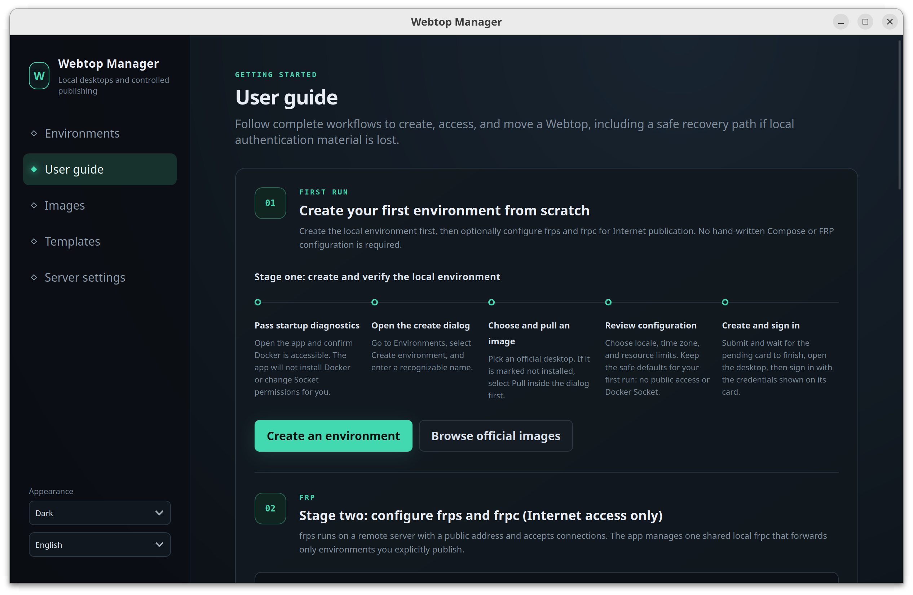

<div align="center">
  
  <h1>Webtop Manager</h1>
  <p><strong>Put a Linux desktop in your pocket and open it wherever you are.</strong></p>
  <p>
    Skip hand-written Compose files, repeated setup, and painful migrations: create, manage,<br>
    remotely access, and move persistent Linux desktops on local Docker from one secure app.
  </p>
  <p>
    <a href="README.md">English</a> · <a href="README.zh-CN.md">简体中文</a>
  </p>
  <p>
    <a href="https://github.com/IntHelloWorld/webtop-manager/actions/workflows/ci.yml"></a>
    <a href="docs/v1-status.md"></a>
    <a href="LICENSE"></a>
    
    
  </p>
</div>



## Why Webtop Manager?

[LinuxServer Webtop](https://docs.linuxserver.io/images/docker-webtop/) puts a
full Linux desktop in your browser. Webtop Manager turns it into a focused
desktop workflow: choose an official image, configure an environment, and let
the app handle its lifecycle without hand-editing Compose files.

- **Local first** — your Docker daemon, configuration, and desktop data stay on
  infrastructure you control.
- **Safe ownership boundaries** — only fully labeled, app-owned resources are
  managed; existing Compose projects and containers are left alone.
- **Durable by design** — Webtops, tunnels, and long template operations keep
  running after the UI closes.
- **Portable environments** — export a versioned `.wtmpl` containing both the
  container image and the complete `/config` data, then validate it offline on
  import.
- **Remote access on your terms** — publication is off by default and enabled
  per environment through a managed FRP client.

## What you can do

| | Capability | Highlights |
| --- | --- | --- |
| 🖥️ | **Manage Webtops** | Create, start, stop, restart, and safely delete app-owned environments. |
| 🧩 | **Choose official images** | Browse an allowlisted LinuxServer catalog, detect local images, and follow pull progress. |
| 🎛️ | **Configure without guesswork** | Use guided options for desktop, locale, devices, mounts, and advanced Webtop settings. |
| 📦 | **Create portable templates** | Preserve image layers and the full `/config`; import and export verified `.wtmpl` packages. |
| 🌐 | **Publish explicitly** | Configure one shared frpc and publish individual environments with generated public links. |
| 🛡️ | **Keep risky operations contained** | Use typed APIs, canonical path checks, ownership labels, and secret files instead of arbitrary shell or Docker commands. |
| 🌏 | **Work in your language** | Switch the complete interface between English and Simplified Chinese. |

## Quick start

### 1. Check compatibility

| Requirement | Version 1.0 support |
| --- | --- |
| Operating system | Linux x86_64 |
| Tested distribution | Ubuntu 24.04 |
| Container runtime | Local Docker Engine |
| Managed environments | Newly created by Webtop Manager only |
| Packages | Debian package and AppImage |

Docker Engine is a prerequisite and must be installed and administered
separately. Webtop Manager never installs Docker, changes group membership, or
weakens Docker Socket permissions.

### 2. Download and verify

Published builds appear on the [Releases
page](https://github.com/IntHelloWorld/webtop-manager/releases). Download
`SHA256SUMS` and the `.deb` or AppImage, then verify the package in the download
directory. If the 1.0 release has not been published yet, use the development
setup below.

```bash
sha256sum --check SHA256SUMS --ignore-missing
```

### 3. Install or run

```bash
# Debian / Ubuntu
sudo apt install ./webtop-manager_*_amd64.deb

# AppImage
chmod +x ./webtop-manager_*_amd64.AppImage
./webtop-manager_*_amd64.AppImage
```

If Docker is missing or inaccessible, the app still opens and shows diagnostic
guidance. Host access remains an administrator decision.

## Security by design

Webtop Manager deliberately exposes a narrow management surface:

- The WebView can call fixed Tauri commands, not arbitrary shell, Docker JSON,
  host paths, or URLs.
- A persistent Rust controller serves a versioned API over a mode-`0600` Unix
  Socket and reconciles only resources with the complete
  `com.cue.webtop-manager.*` label set.
- Passwords and FRP tokens are stored in protected files rather than Docker
  environment values, SQLite rows, logs, or frontend events.
- FRP tokens are generated once and reused across app reinstalls. If the local
  secret is lost, a fingerprint-backed recovery flow re-pairs the managed frps
  without exposing routine token rotation.
- Internet publication starts disabled and requires explicit confirmation for
  each environment.
- Managed-data deletion uses canonical containment checks. External mounts are
  never deleted automatically.

> [!WARNING]
> Access to `/var/run/docker.sock` is effectively root-equivalent. Installing
> Webtop Manager grants its controller control over the local Docker daemon.
> Read the [security model](docs/security.md) before installation and the
> [FRP guide](docs/frps-setup.md) before exposing a Webtop publicly.

> [!CAUTION]
> Templates and snapshots are **not encrypted**. A `.wtmpl` may contain SSH
> keys, browser profiles, cloud credentials, and other secrets from `/config`.
> Never commit one to a repository or attach one to a public issue.

## How it works

```text
┌─────────────────────┐
│ React + TypeScript  │  Bilingual desktop UI
└──────────┬──────────┘
           │ allowlisted Tauri commands + redacted events
┌──────────▼──────────┐
│ Tauri 2 desktop app │  Diagnostics, bootstrap, native file transfer
└──────────┬──────────┘
           │ mode-0600 Unix Socket · versioned /v1 API
┌──────────▼──────────┐
│ Rust controller     │  Persistent lifecycle and SQLite state
└──────────┬──────────┘
           │ local Docker Socket
┌──────────▼────────────────────────────────────────────┐
│ Owned Webtops · frpc · isolated workers · /config    │
└───────────────────────────────────────────────────────┘
```

The desktop UI can close without taking down managed environments, FRP
tunnels, or active template operations. For the complete trust and state model,
see [Architecture](docs/architecture.md).

## Development

The reproducible development setup targets Ubuntu 24.04 x86_64 with Rust
1.88.0, Node.js 22.23.2, pnpm 10.4.1, Docker Engine, `zstd`, and the Tauri 2
Linux system libraries.

```bash
git clone https://github.com/IntHelloWorld/webtop-manager.git
cd webtop-manager

./scripts/setup-dev.sh --install-system-deps
./scripts/doctor.sh
./scripts/dev.sh
```

Run the repository checks:

```bash
./scripts/check.sh
cargo check --package webtop-manager --locked
./scripts/check-release-version.sh
```

After changing the controller, worker, or API, rebuild and verify the embedded
controller image:

```bash
./scripts/package-controller.sh
zstd --test --quiet src-tauri/assets/controller-image.tar.zst
./scripts/test-packaged-controller.sh
```

See the [development guide](docs/development.md) for prerequisites,
troubleshooting, and additional commands.

## Project status and roadmap

Version 1.0 covers the complete create/manage/publish/template flow, durable
image-pull recovery, FRP port-race retry, controller upgrade rollback, and
Docker-backed release acceptance. Safe environment rebuilds, general-purpose
image administration, and user-configurable storage roots are explicitly
outside the 1.0 scope. See [v1 implementation status](docs/v1-status.md).

No automatic updater is included in version 1.0.

## Documentation

- [Architecture](docs/architecture.md) — processes, ownership, state, and API boundaries
- [Security model](docs/security.md) — enforced invariants and exposure risks
- [Development guide](docs/development.md) — setup, validation, and troubleshooting
- [Remote FRP setup](docs/frps-setup.md) — server deployment and verification
- [v1 status](docs/v1-status.md) — accepted scope and explicit non-goals
- [Changelog](CHANGELOG.md) — notable project changes

## Contributing

Contributions and focused bug reports are welcome. Please read
[CONTRIBUTING.md](CONTRIBUTING.md) before opening a pull request. Report
security vulnerabilities privately according to [SECURITY.md](SECURITY.md),
never through a public issue.

## License

Webtop Manager is available under the [MIT License](LICENSE). Third-party
components remain subject to their respective licenses.
