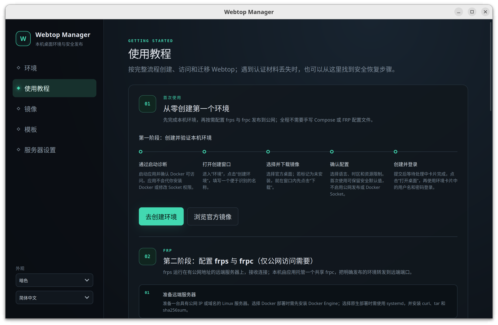

<div align="center">
  
  <h1>Webtop Manager</h1>
  <p><strong>把 Linux 桌面装进口袋，随时随地打开就用。</strong></p>
  <p>
    告别手写 Compose、反复配置和环境搬家：用一个桌面应用，在本机 Docker 上<br>
    创建、管理、远程访问和迁移你能随时随地访问的 Linux 桌面环境。
  </p>
  <p>
    <a href="README.md">English</a> · <a href="README.zh-CN.md">简体中文</a>
  </p>
  <p>
    <a href="https://github.com/IntHelloWorld/webtop-manager/actions/workflows/ci.yml"></a>
    <a href="docs/v1-status.zh-CN.md"></a>
    <a href="LICENSE"></a>
    
    
  </p>
</div>



## 为什么选择 Webtop Manager？

[LinuxServer Webtop](https://docs.linuxserver.io/images/docker-webtop/) 能把完整的
Linux 桌面带进浏览器。Webtop Manager 在此基础上提供了一套专注的桌面工作流：
选择官方镜像、配置环境，随后由应用管理完整生命周期，不再需要手工维护
Compose 文件。

- **本地优先** — Docker 守护进程、配置和桌面数据都留在你掌控的基础设施中。
- **清晰的资源边界** — 只管理带有完整标签的应用自有资源，不接管、不修改现有
  Compose 项目或容器。
- **持久运行** — 即使关闭管理界面，Webtop、隧道和耗时的模板操作仍会继续运行。
- **环境可迁移** — 导出同时包含容器镜像与完整 `/config` 数据的版本化 `.wtmpl`，
  导入时可离线完成严格校验。
- **远程访问由你决定** — 默认关闭公网发布，仅在你明确操作后通过托管的 FRP
  客户端按环境开启。

## 你可以用它做什么

| | 能力 | 亮点 |
| --- | --- | --- |
| 🖥️ | **管理 Webtop** | 创建、启动、停止、重启和安全删除应用创建的环境。 |
| 🧩 | **选择官方镜像** | 浏览经过允许列表约束的 LinuxServer 镜像，识别本地镜像并查看拉取进度。 |
| 🎛️ | **告别配置猜测** | 通过引导式选项配置桌面、语言、设备、挂载及 Webtop 高级参数。 |
| 📦 | **制作便携模板** | 同时保存镜像层和完整 `/config`，导入、导出经过校验的 `.wtmpl` 包。 |
| 🌐 | **按需公开访问** | 配置一个共享 frpc，为单个环境生成并管理公网访问链接。 |
| 🛡️ | **约束高风险操作** | 使用类型化 API、规范路径检查、所有权标签和秘密文件，拒绝任意 Shell 或 Docker 指令。 |
| 🌏 | **使用熟悉的语言** | 整个应用界面可在简体中文和英文之间切换。 |

## 快速开始

### 1. 确认兼容性

| 要求 | 1.0 版本支持范围 |
| --- | --- |
| 操作系统 | Linux x86_64 |
| 已测试发行版 | Ubuntu 24.04 |
| 容器运行时 | 本机 Docker Engine |
| 可管理环境 | 仅由 Webtop Manager 新建的环境 |
| 安装包 | Debian 软件包与 AppImage |

Docker Engine 是前置依赖，需要单独安装并由主机管理员维护。Webtop Manager
不会安装 Docker、修改用户组，也不会降低 Docker Socket 的权限。

### 2. 下载并校验

已经发布的构建会出现在 [Releases
页面](https://github.com/IntHelloWorld/webtop-manager/releases)。下载 `SHA256SUMS`
以及 `.deb` 或 AppImage，然后在下载目录执行以下命令。如果 1.0 版本暂未发布，
请使用下文的开发环境进行构建。

```bash
sha256sum --check SHA256SUMS --ignore-missing
```

### 3. 安装或直接运行

```bash
# Debian / Ubuntu
sudo apt install ./webtop-manager_*_amd64.deb

# AppImage
chmod +x ./webtop-manager_*_amd64.AppImage
./webtop-manager_*_amd64.AppImage
```

即使 Docker 尚未安装或当前无法访问，应用仍能正常打开并显示诊断指引；是否调整
主机访问权限始终由管理员决定。

## 安全设计

Webtop Manager 有意保持一条狭窄、可审计的管理通道：

- WebView 只能调用固定的 Tauri 命令，不能传入任意 Shell、Docker JSON、主机路径
  或网址。
- 常驻 Rust 控制器通过权限为 `0600` 的 Unix Socket 提供版本化 API，并且只协调
  带有完整 `com.cue.webtop-manager.*` 标签集的资源。
- 密码和 FRP Token 存放在受保护的文件中，不进入 Docker 环境变量、SQLite、日志
  或前端事件。
- FRP Token 只在首次使用时生成，并在应用重装后继续复用；本地秘密丢失时通过指纹
  检测和受限恢复流程重新配对受管 frps，不提供日常 Token 轮换入口。
- 默认关闭公网发布，每个环境都必须经过明确确认才能开启。
- 删除托管数据前会进行规范路径边界检查，外部挂载目录永远不会被自动删除。

> [!WARNING]
> 访问 `/var/run/docker.sock` 实际上等同于拥有主机 root 权限。安装 Webtop Manager
> 意味着允许其控制器管理本地 Docker 守护进程。安装前请阅读[安全模型](docs/security.zh-CN.md)，
> 将 Webtop 暴露到公网前请阅读 [FRP 指南](docs/frps-setup.zh-CN.md)。

> [!CAUTION]
> 模板和快照**没有加密**。`.wtmpl` 可能包含 `/config` 中的 SSH 密钥、浏览器资料、
> 云凭据及其他秘密。请勿将其提交到代码仓库，也不要附加到公开 Issue 中。

## 工作原理

```text
┌─────────────────────┐
│ React + TypeScript  │  中英双语桌面界面
└──────────┬──────────┘
           │ 允许列表约束的 Tauri 命令 + 脱敏事件
┌──────────▼──────────┐
│ Tauri 2 桌面应用    │  诊断、启动引导、原生文件传输
└──────────┬──────────┘
           │ 权限 0600 的 Unix Socket · 版本化 /v1 API
┌──────────▼──────────┐
│ Rust 常驻控制器     │  持久生命周期管理与 SQLite 状态
└──────────┬──────────┘
           │ 本机 Docker Socket
┌──────────▼────────────────────────────────────────────┐
│ 应用自有 Webtop · frpc · 隔离 Worker · /config       │
└───────────────────────────────────────────────────────┘
```

关闭桌面界面不会终止受管环境、FRP 隧道或正在进行的模板操作。完整的信任边界和
状态模型请参阅[架构文档](docs/architecture.zh-CN.md)。

## 参与开发

可复现的开发环境面向 Ubuntu 24.04 x86_64，需要 Rust 1.88.0、Node.js
22.23.2、pnpm 10.4.1、Docker Engine、`zstd` 和 Tauri 2 的 Linux 系统依赖。

```bash
git clone https://github.com/IntHelloWorld/webtop-manager.git
cd webtop-manager

./scripts/setup-dev.sh --install-system-deps
./scripts/doctor.sh
./scripts/dev.sh
```

运行仓库的完整检查：

```bash
./scripts/check.sh
cargo check --package webtop-manager --locked
./scripts/check-release-version.sh
```

修改控制器、Worker 或 API 后，需要重新构建并校验内置控制器镜像：

```bash
./scripts/package-controller.sh
zstd --test --quiet src-tauri/assets/controller-image.tar.zst
./scripts/test-packaged-controller.sh
```

有关依赖安装、故障排查和更多命令，请查看[开发指南](docs/development.zh-CN.md)。

## 项目状态与路线图

1.0 版本已覆盖创建、管理、发布和模板迁移的完整流程，以及镜像拉取恢复、FRP
端口竞争重试、控制器升级回滚和基于真实 Docker 的发布验收。环境安全重建、通用
镜像管理和用户自定义存储根目录被明确排除在 1.0 范围之外。详细清单请查看
[v1 实现状态](docs/v1-status.zh-CN.md)。

1.0 版本暂不提供自动更新功能。

## 文档

- [架构](docs/architecture.zh-CN.md) — 进程、资源所有权、状态和 API 边界
- [安全模型](docs/security.zh-CN.md) — 强制安全约束与公开访问风险
- [开发指南](docs/development.zh-CN.md) — 环境配置、验证与故障排查
- [远程 FRP 配置](docs/frps-setup.zh-CN.md) — 服务端部署和连通性验证
- [v1 状态](docs/v1-status.zh-CN.md) — 已验收范围和明确的非目标
- [更新日志](CHANGELOG.zh-CN.md) — 项目的重要变更

## 参与贡献

欢迎贡献代码和提交聚焦的问题报告。发起 Pull Request 前请阅读
[CONTRIBUTING.zh-CN.md](CONTRIBUTING.zh-CN.md)。安全漏洞请按照 [SECURITY.zh-CN.md](SECURITY.zh-CN.md)
私下报告，切勿通过公开 Issue 披露。

## 许可证

Webtop Manager 使用 [MIT License](LICENSE) 开源。第三方组件仍遵循各自的许可证。
